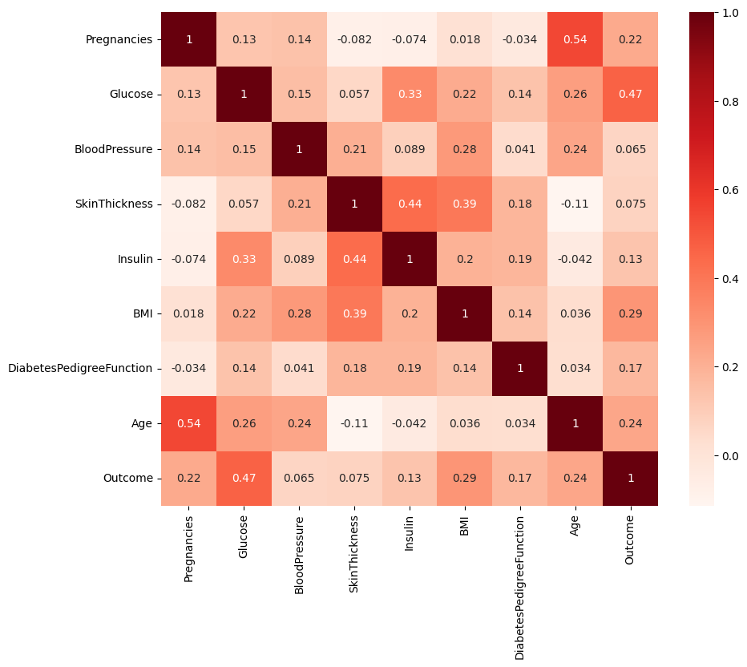
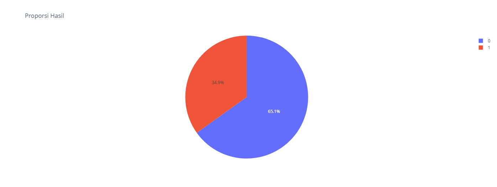
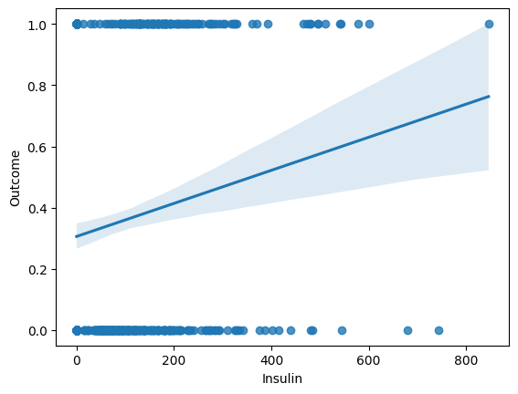
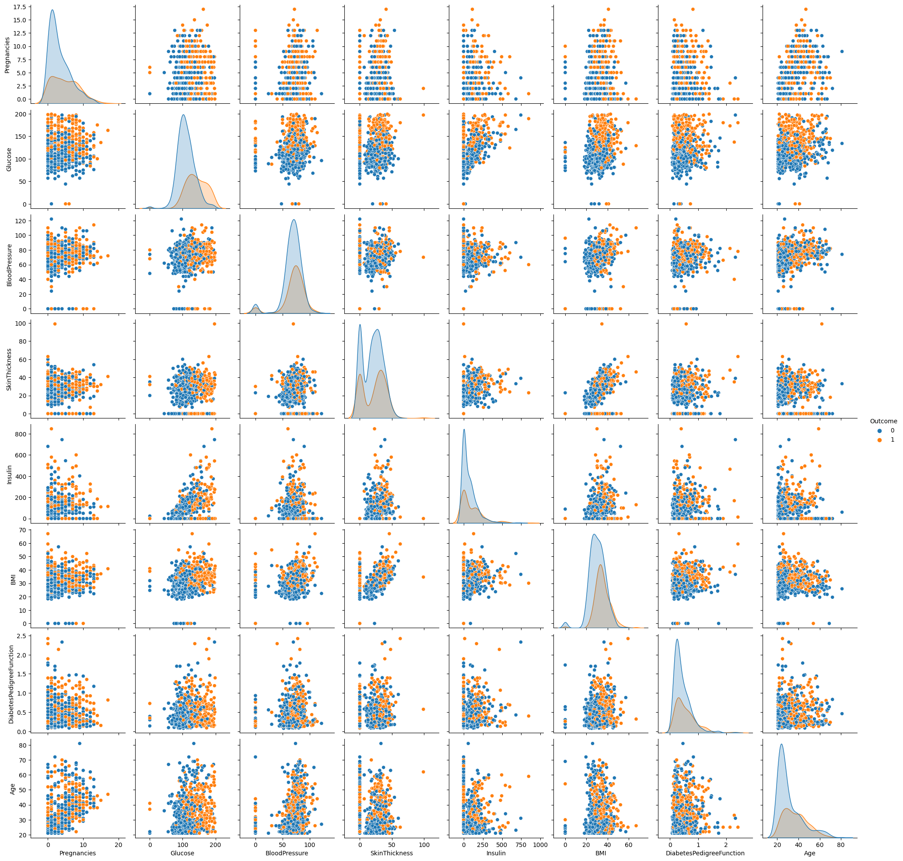
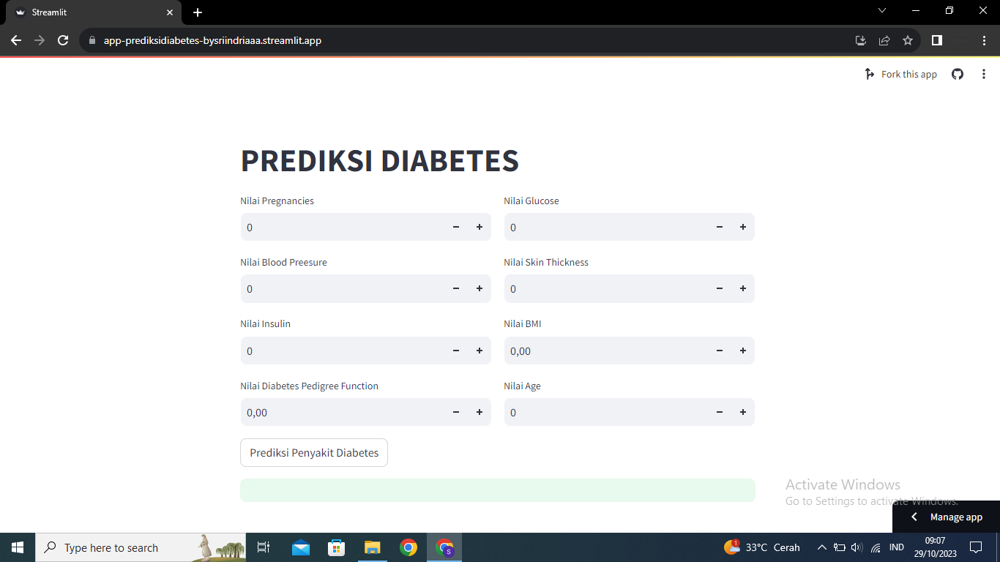

# Laporan Proyek Machine Learning
### Nama : Sri Indriawati
### Nim : 211351141
### Kelas : Pagi A

## Prediksi Penyakit Diabetes Menggunakan Algoritma Logistic Regression
Diabetes adalah penyakit kronis yang mempengaruhi jutaan orang di seluruh dunia, dan angka penderita terus meningkat. Banyak faktor yang mempengaruhi orang menderita diabetes, beberapa diantaranya yaitu tekanan darah tinggi, kadar gula berlebih, berat badan, riwayat keturunan diabetes, usia, jumlah kehamilan seseorang, ketebalan lipatan kulit, dan jumlah kadar insulin dalam tubuh. Penyakit ini memiliki dampak kesehatan yang serius dan dapat menyebabkan komplikasi seperti penyakit jantung, kerusakan ginjal, buta, dan lainnya. Oleh karena itu, identifikasi dini dan manajemen yang efektif sangat penting.
Regresi logistik merupakan salah satu alat statistik yang dapat digunakan dalam pemodelan klasifikasi tentang ada tidaknya yang mengalami diabetes. Tujuan dari pembuatan data mining ini adalah untuk memprediksi secara diagnostik apakah pasien menderita diabetes atau tidak.

**Masalah ini perlu diselesaikan karena :**
1. Jumlah diabetes terus meningkat secara global, terutama tipe 2 diabetes yang sering kali dapat dicegah atau dikelola melalui perubahan gaya hidup dan perawatan yang tepat.
2. Sistem perawatan kesehatan sering kali terbatas dalam hal sumber daya dan waktu. Dengan alat prediksi diabetes, kita dapat mengidentifikasi individu yang berisiko tinggi, sehingga sumber daya dan perawatan dapat dialokasikan dengan lebih efisien.
3. Dengan mengidentifikasi individu yang berisiko, kita dapat memberikan informasi pencegahan dan perawatan dini yang dapat mengurangi risiko komplikasi diabetes yang serius, seperti penyakit jantung, gagal ginjal, dan gangguan mata.

**Cara penyelesaian masalah :** <br>
Cara menyelesaikannya adalah melalui penggunaan data mining dan analisis data yang mendalam. Dengan memanfaatkan data historis dan faktor-faktor yang relevan seperti riwayat kesehatan, genetika, pola makan, dan gaya hidup, kita dapat membangun model prediksi diabetes yang dapat mengklasifikasikan individu sebagai berisiko diabetes atau tidak. Ini akan membantu dalam pencegahan, manajemen, dan pengelolaan penyakit ini secara lebih efektif.
Untuk memprediksi penyakit diabetes menggunakan algoritma logistic regression, kita memerlukan data yang sesuai, seperti data medis dan faktor resiko yang relevan. <br>
Referensi :<br>
[Prediksi Risiko Penyakit Diabetes menggunakan Algoritma Regresi Logistik](https://journal.literasisains.id/index.php/jomlai/article/view/598/470)

## Business Understanding
Tujuan bisnis dari proyek ini adalah untuk memanfaatkan data mining guna memprediksi apakah seseorang berisiko menderita diabetes atau tidak. Informasi ini dapat digunakan untuk penyuluhan kesehatan, pencegahan, dan perawatan yang lebih tepat sasaran.

### Problem Statements
Masalah utama yang ingin kita selesaikan adalah kesulitan dalam mengidentifikasi faktor-faktor yang dapat mempengaruhi risiko seseorang terkena diabetes. Kita ingin memahami pola dan faktor risiko yang berkaitan dengan diabetes melalui analisis data yang tepat.

### Goals
- Mengimplementasikan algoritma regresi logistik untuk membangun model prediksi diabetes yang dapat mengklasifikasikan individu menjadi dua kelompok: berisiko diabetes atau tidak berisiko diabetes.
- Menguji dan mengevaluasi kinerja model prediksi menggunakan metrik akurasi, presisi, recall dan F1-score.
- Meningkatkan kesadaran masyarakat tentang faktor risiko diabetes.
- Memberikan informasi yang dapat membantu individu dan penyedia layanan kesehatan dalam mengambil langkah-langkah pencegahan dan perawatan yang sesuai.

    ### Solution statements
    - Solusi yang diusulkan adalah mengumpulkan dan membersihkan data kesehatan pasien yang mencakup faktor-faktor seperti usia, jenis kelamin, riwayat keluarga, indeks massa tubuh (BMI), pola makan, dan tingkat aktivitas fisik.
    - Selanjutnya, kita akan menggunakan algoritma Regresi Logistik untuk mengembangkan model prediksi. Model ini akan diuji dengan dataset yang berbeda dan dievaluasi berdasarkan metrik akurasi, presisi, recall dan F1-score.

## Data Understanding
Kumpulan data ini berasal dari National Institute of Diabetes and Digestive and Kidney Penyakit. Tujuan dari kumpulan data ini adalah untuk memprediksi secara diagnostik apakah seorang pasien menderita diabetes, berdasarkan pengukuran diagnostik tertentu yang termasuk dalam kumpulan data. Beberapa kendala ditempatkan pada pemilihan contoh ini dari database yang lebih besar. Secara khusus, semua pasien di sini adalah perempuan minimal berusia 21 tahun keturunan Indian Pima.

Dataset : [Predict Diabetes](https://www.kaggle.com/datasets/whenamancodes/predict-diabities)

### Variabel-variabel pada dataset
Variabel-variabel pada dataset [Predict Diabetes](https://www.kaggle.com/datasets/whenamancodes/predict-diabities) ialah :
| No. | Nama Variabel | Type Data | Keterangan |
|-----|---------------|-----------|------------|
| 1. | Pregnancies | Int | Merupakan jumlah kehamilan yang pernah dialami seseorang. |
| 2. | Glucose | Int | merupakan kadar gula darah (glukosa) dalam darah. |
| 3. | BloodPressure | Int | merupakan tekanan darah, biasanya diukur dalam milimeter raksa(mmHg). |
| 4. | SkinThickness | Int | merupakan ketebalan kulit pada trisep lengan atas, biasanya dikur dalam milimeter. |
| 5. | Insulin | Int | merupakan kadar insulin dalam darah. |
| 6. | BMI | Float | Merupakan index massa tubuh, yang mengukur hubungan antara berat badan dan tinggi badan. |
| 7. | DiabetesPedigreeFunction | Float | Merupakan sebuah nilai yang mencerminkan riwayat keluarga diabetes. |
| 8. | Age | Int | Merupakan usia seseorang. |
| 9. | Outcome | Int | Merupakan status diabetes seseorang.<br> 0 : tidak menderita diabetes (negatif),<br> 1 : menderita diabetes (positif). |

**Visualisasi Data**<br>
Beberapa hasil visualisasi data : <br>
<br>
Heatmap diatas menunjukkan seberapa kuat hubungan korelasi antara setiap pasangan kolom dalam dataset.<br>
<br>
<br>
Grafik pie chart (diagram lingkaran) diatas itu berdasarkan data yang disimpan dalam dataset.<br> 
0 menunjukkan hasil data yang tidak diabetes dan 1 menunjukkan hasil data yang diabetes.<br>
<br>
<br>
Scatter plot diatas merupakan hasil visualisasikan hubungan antara dua variabel.<br>
x=df['Insulin']: Digunakan sebagai sumbu X dalam scatter plot. <br>
y=df['Outcome']: Digunakan sebagai sumbu Y dalam scatter plot. <br>
<br>
<br>
Hasil visualisasi hubungan antara semua pasangan variabel dalam dataset dalam bentuk matrix scatter plot, juga untuk membedakan data berdasarkan kolom 'Outcome' menggunakan warna.<br>

## Data Preparation
Penggunaan algoritma logistik regresi untuk prediksi penyakit diabetes, teknik persiapan data mencakup langkah-langkah yang saya lakukan ialah :
1. Mencari dataset yang berisi informasi tentang pasien, termasuk variabel seperti usia, indeks massa tubuh (BMI), tingkat gula darah, riwayat keluarga, dll.
2. Memvisualisasikan data untuk memilih fitur atau variabel yang paling relevan untuk prediksi penyakit diabetes.
4. Membagi dataset menjadi dua bagian, yaitu data pelatihan (training data) dan data pengujian (testing data) untuk mengukur kinerja model.
5. Membuat model dengan algoritma logistik regresi dan setel parameter-parameternya sesuai kebutuhan.
6. Mengevaluasi data menggunakan data pengujian untuk mengukur kinerja model menggunakan metrik seperti akurasi, presisi, recall, F1-score.
7. Mencoba model prediksi untuk mengecek hasilnya sesuai atau tidak.
8. Pengeimplementasian model setelah semuanya sesuai dan dievaluasi dengan baik, dapat digunakan untuk memprediksi penyakit diabetes pada data baru.<br>
Tahapan data preparation adalah dasar yang diperlukan untuk memastikan bahwa analisis data mining prediksi diabetes menggunakan algoritma logistik regresi dapat dilakukan dengan akurat dan hasil yang dapat diandalkan.

## Modeling Learning Regression
Model machine learning regresi logistik adalah salah satu alat yang umum digunakan untuk memprediksi apakah seseorang mungkin mengalami diabetes atau tidak. Ini adalah model statistik yang menghubungkan variabel independen atau prediktor (faktor risiko diabetes) dengan variabel dependen (diabetes atau tidak) menggunakan fungsi logistik.

```python
model = LogisticRegression()

model.fit(X_train, Y_train)
```

**Kelebihan dan Kekurangan Modeling Learning Regression**:
- Kelebihan Logistic Regression:
  - Hasil dari model logistic regression dapat diinterpretasikan dengan relatif mudah. Koefisien untuk setiap variabel dapat digunakan untuk memahami pengaruh relatifnya terhadap prediksi diabetes.
  - Model ini cocok untuk masalah klasifikasi biner, seperti prediksi diabetes atau tidak diabetes. Ini memberikan hasil berupa probabilitas klasifikasi.
  - Logistic regression adalah model yang efisien dan dapat menangani dataset yang cukup besar dengan cepat.
  - Model ini tidak bergantung pada asumsi normalitas data, sehingga dapat digunakan untuk berbagai jenis data.
- Kekurangan Logistic Regression:
  - Model logistic regression hanya dapat menangani hubungan linear antara variabel independen dan variabel dependen. Jika hubungan tidak linear, model ini mungkin tidak akurat.
  - Jika terdapat banyak variabel kategori dengan banyak kategori, model ini mungkin tidak efisien. Penggunaan one-hot encoding dapat memunculkan masalah multikolinearitas.
  - Model ini mengasumsikan independensi antara observasi, yang mungkin tidak selalu terpenuhi dalam data deret waktu atau data yang terkait.
  - Jika terdapat banyak data yang hilang, penanganannya dalam logistic regression dapat menjadi rumit.
  - Untuk beberapa masalah klasifikasi yang sangat kompleks, model logistic regression mungkin tidak memberikan performa yang sebaik model machine learning yang lebih kompleks.
  - Logistic regression memiliki batasan dalam memodelkan klasifikasi yang sangat ketat, di mana batasan keputusan yang sempit diperlukan.

## Evaluation
Evaluation dilakukan dengan menghitung nilai-nilai pada metrik akurasi, presisi, recall, dan f1-score. Metriks tersebut digunakan untuk menentukan apakah model mempunyai performa yang baik atau tidak.
- ***Akurasi***<br>
Akurasi mengukur sejauh mana model benar dalam memprediksi baik kelas positif (diabetes) maupun kelas negatif (non-diabetes).
  - Akurasi data training
  ```python
  X_train_prediction = model.predict(X_train)
  train_data_accuracy = accuracy_score(X_train_prediction, Y_train)

  print('Akurasi data training :', train_data_accuracy)
  ```
  >***Hasil yang didapatkan ialah 78%***

  - Akurasi data testing
  ```python
  X_test_prediction = model.predict(X_test)
  test_data_accuracy = accuracy_score(X_test_prediction, Y_test)

  print('Akurasi data testing :', test_data_accuracy)
  ```
  >***Hasil yang didapatkan ialah 75%***

- ***Presisi***
Presisi merupakan perhitungan untuk mengetahui jumlah data yang benar positif dari semua hasil prediksi benar positif.
  ```python
  precision=metrics.precision_score(Y_test,X_test_prediction)

  print('Presisi :', precision)
  ```
  >***Hasil yang didapatkan ialah 70%***
- ***Recall***<br>
Recall mengukur sejauh mana model dapat mengidentifikasi semua kasus positif yang sebenarnya (diabetes).
  ```python
  recall=metrics.recall_score(Y_test,X_test_prediction)

  print('Recall :', recall)
  ```
  >***Hasil yang didapatkan ialah 52%***
- ***F1 score***<br>
F1-Skor adalah ukuran gabungan yang mempertimbangkan presisi dan recall. Ini berguna ketika ingin mencapai keseimbangan antara ketepatan dan kemampuan model untuk mengidentifikasi semua kasus positif.
  ```python
  f1score=metrics.f1_score(X_test_prediction, Y_test)

  print('F1 score :', f1score)
  ```
  >***Hasil yang didapatkan ialah 60%***

**Hasil evaluasi secara keseluruhan sudah cukup baik.**

## Deployment
Coba sekarang, disini : 
[Streamlit Link Prediksi Diabetes](https://app-prediksidiabetes-bysriindriaaa.streamlit.app/) <br>
<br>


